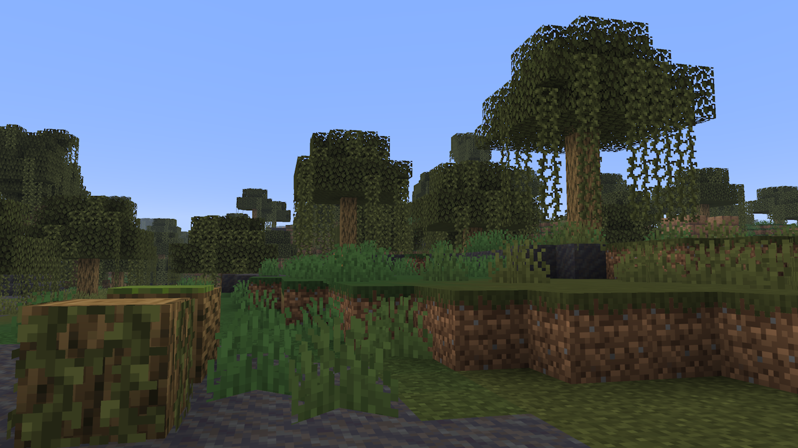
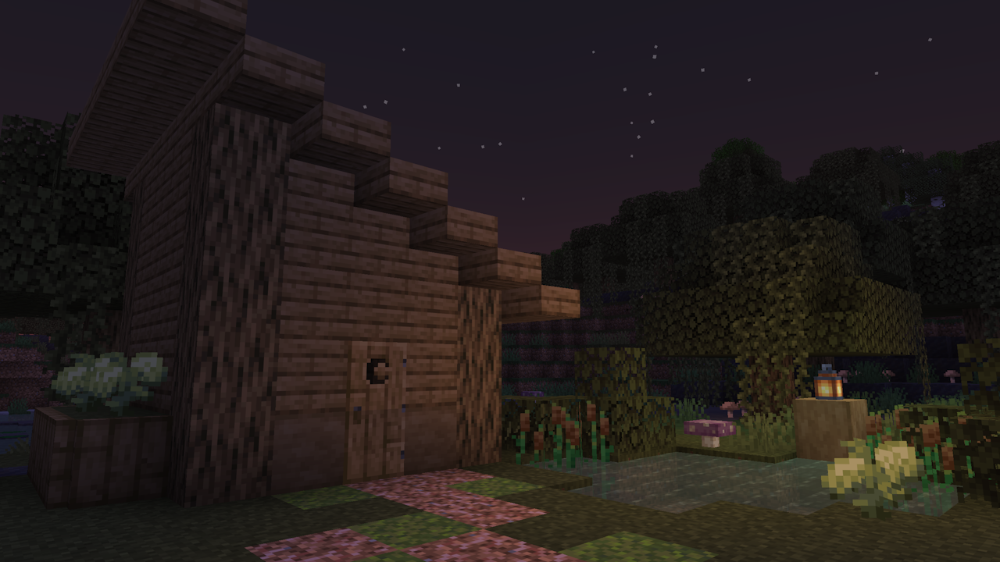
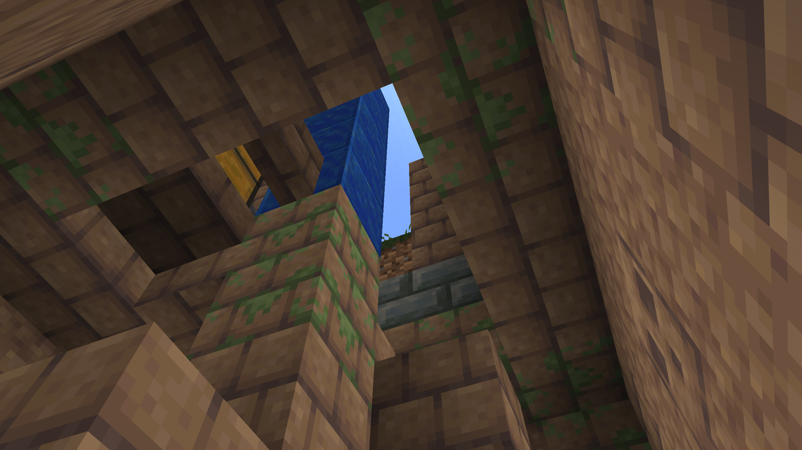

# Soggy Swamps

[Modrinth Page](https://modrinth.com/project/MYEsLzrI)

Soggy Swamps is a mod overhauling the vanilla Swamp biome,
adding various new features to bring more life to it!

## Features

Improved swamp generation, including mud patches and occasional Mangrove trees,
making both materials less difficult to get if you can't find a Mangrove Swamp.

A full Swamp Oak woodset, with trees designed to emulate the feel of the original vanilla swamp.
Three new plants, Rot Caps, Bogsprouts, and Cattails, which can all be used to craft some otherwise tricky-to-find dyes.

A new village variant, with consideration put into their architecture and the types of materials they have access to.
This also makes Swamp Villagers accessible without constructing a location of your own.

A small archeology structure buried under the mud, the Swamp Tower.
Brushing the Suspicious Mud here will get you 3 new sherds and the new Spore Armor Trim.

## Dependencies

Soggy Swamps depends on [PneumonoCore](https://modrinth.com/project/ZLKQjA7t)

[Download Soggy Swamps on Modrinth](https://modrinth.com/project/MYEsLzrI)